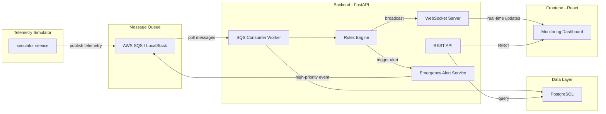
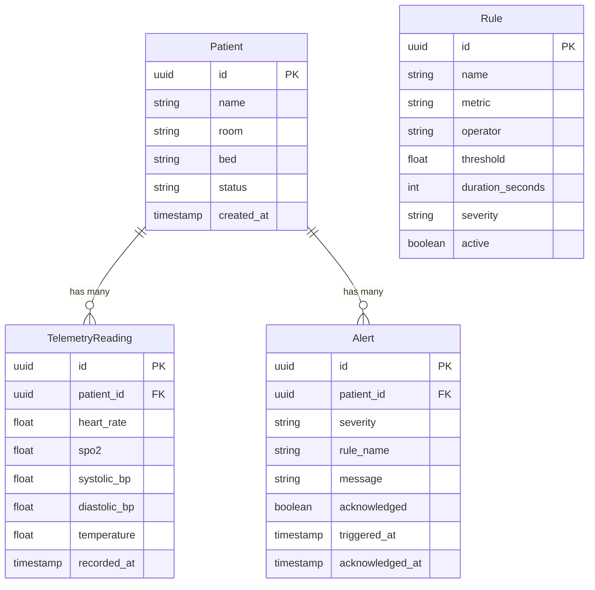

# Patient Monitoring Module

## Architecture Overview




## Technology Stack


| Layer | Technology |
| ----- | ---------- |


- **Backend Framework**: FastAPI (async, WebSocket support, auto-generated OpenAPI docs)
- **Task/Worker**: Background asyncio tasks consuming SQS
- **Message Queue**: AWS SQS (LocalStack for local development)
- **Database**: PostgreSQL 16 with SQLAlchemy (async) + Alembic for migrations
- **Real-time**: WebSockets via FastAPI for pushing live telemetry and alerts to the dashboard
- **Frontend**: React 18 + TypeScript + Vite
- **UI Library**: Material UI (MUI) for medical-grade dashboard look
- **Charting**: Recharts for vital signs graphs
- **State Management**: Zustand (lightweight) + React Query for server state
- **Deployment**: Docker Compose with 4 services (postgres, localstack, backend, frontend)

## Project Structure

```
dapi2/
  backend/
    app/
      main.py                  # FastAPI app entry point
      config.py                # Settings via pydantic-settings
      models/                  # SQLAlchemy ORM models
        patient.py
        telemetry.py
        alert.py
      schemas/                 # Pydantic request/response schemas
        patient.py
        telemetry.py
        alert.py
      api/                     # REST route handlers
        patients.py
        telemetry.py
        alerts.py
        websocket.py           # WebSocket endpoint
      services/
        sqs_consumer.py        # Background SQS polling worker
        rules_engine.py        # Configurable rule evaluation
        alert_service.py       # Emergency alert dispatching
        simulator.py           # Telemetry data simulator
      db/
        session.py             # Async SQLAlchemy session
        migrations/             # Alembic migrations
    requirements.txt
    Dockerfile
    alembic.ini
  frontend/
    src/
      components/
        Dashboard/             # Main monitoring panel
        PatientCard/           # Individual patient status card
        VitalsChart/           # Real-time vitals chart
        AlertBanner/           # Emergency alert banner
      hooks/
        useWebSocket.ts        # WebSocket connection hook
        usePatients.ts         # React Query hooks
      services/
        api.ts                 # Axios API client
      store/
        alertStore.ts          # Zustand alert state
      types/
        index.ts               # TypeScript interfaces
      App.tsx
      main.tsx
    package.json
    Dockerfile
    vite.config.ts
  docker-compose.yml
  .env.example
  README.md
```

## Core Components Detail

### 1. Telemetry Simulator (`backend/app/services/simulator.py`)

- Generates synthetic sensor data for N configurable patients
- Produces heart rate (60-180 bpm), SpO2 (85-100%), blood pressure, temperature
- Publishes JSON messages to an SQS queue every 1-5 seconds per patient
- Runs as a FastAPI background task (or standalone script via CLI)

### 2. SQS Consumer (`backend/app/services/sqs_consumer.py`)

- Long-polls the SQS telemetry queue in a background asyncio loop
- Deserializes messages, persists readings to PostgreSQL
- Forwards each reading to the Rules Engine for evaluation
- Broadcasts the reading via WebSocket to all connected dashboard clients

### 3. Rules Engine (`backend/app/services/rules_engine.py`)

- Configurable rules stored in a `rules` DB table or a YAML/JSON config
- Example rules:
  - `HR > 120 for 2 minutes` -> generate WARNING alert
  - `SpO2 < 90` -> generate CRITICAL alert (red code)
  - `Temperature > 39.5` -> generate WARNING alert
- Maintains a sliding time window per patient (in-memory with Redis-like TTL dict)
- When a rule triggers, creates an Alert record and invokes the Alert Service

### 4. Emergency Alert Service (`backend/app/services/alert_service.py`)

- Receives triggered alerts from the Rules Engine
- For red-code alerts, publishes a high-priority message to a separate SQS queue (simulating the Hospitalization Module integration)
- Broadcasts alerts via WebSocket to the dashboard in real-time

### 5. REST API Endpoints

- `GET /api/patients` - list all monitored patients
- `GET /api/patients/{id}` - patient detail with latest vitals
- `GET /api/patients/{id}/telemetry` - historical telemetry readings (paginated)
- `GET /api/alerts` - list alerts (filterable by severity, patient, date)
- `POST /api/alerts/{id}/acknowledge` - acknowledge an alert
- `POST /api/patients` - register a new patient for monitoring
- `WS /ws/monitoring` - WebSocket stream for real-time telemetry + alerts

### 6. Frontend Dashboard

- **Header**: Hospital branding, active alert count badge
- **Patient Grid**: Cards showing each patient's current vitals (HR, SpO2, BP, Temp) with color-coded status (green/yellow/red)
- **Detail View**: Click a patient to see historical vitals charts (Recharts line graphs)
- **Alert Panel**: Side panel or top banner showing active alerts sorted by severity, with acknowledge button
- **Real-time**: WebSocket hook keeps all data live without polling

## Database Schema (PostgreSQL)




## Deployment (Docker Compose)

Four services in `docker-compose.yml`:

- **postgres**: PostgreSQL 16 with a health check, persistent volume
- **localstack**: LocalStack (SQS emulation) for local dev; in production, swap for real AWS SQS via env vars
- **backend**: FastAPI app (uvicorn), depends on postgres + localstack, runs Alembic migrations on startup
- **frontend**: Nginx serving the Vite production build, proxies `/api` and `/ws` to the backend

A `.env.example` file will document all required environment variables (DB URL, SQS queue URL, AWS credentials, etc.).

## Implementation Order

Tasks are ordered by dependency -- each step builds on the previous one.