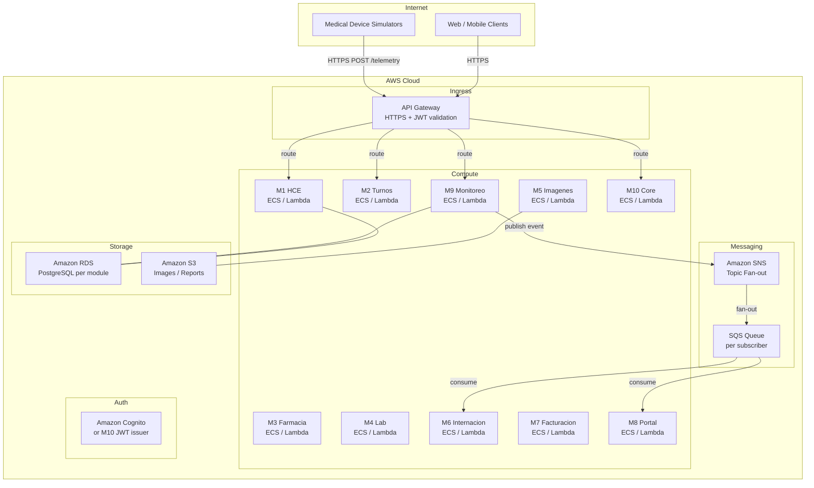
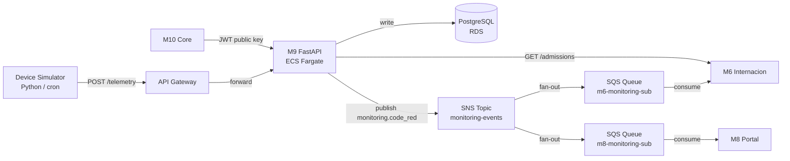
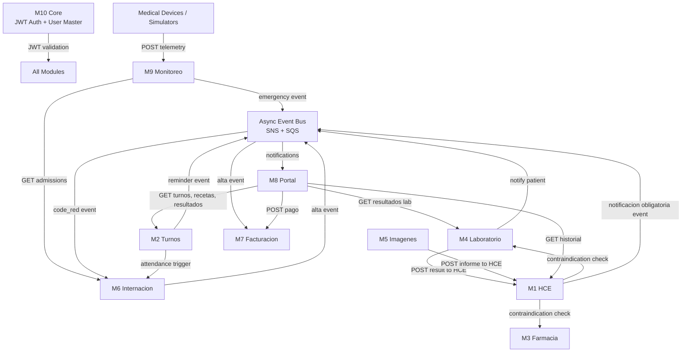
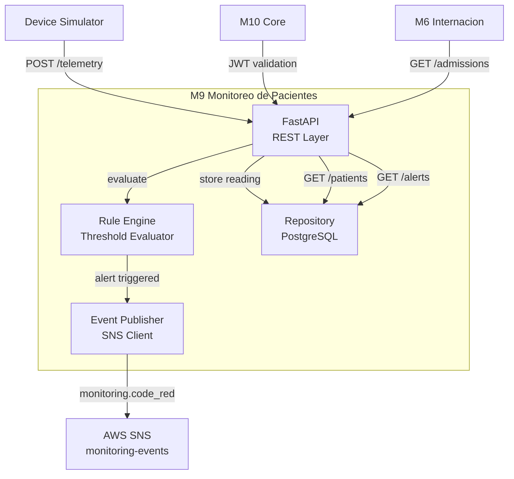
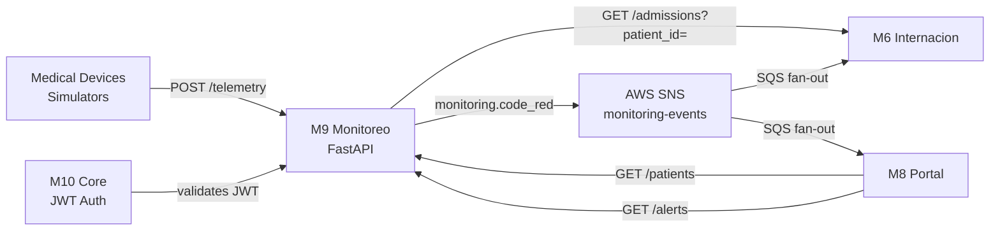

# Health Grid — Base Architecture & API Contracts

> **Trabajo Práctico Obligatorio — Desarrollo de Aplicaciones II**
> Ing. Joaquín Timerman
>
> This document describes the high-level architecture of the **Health Grid** platform, declares the API contracts for every module, and provides a deep-dive into **Módulo 9 — Monitoreo de Pacientes**, which is the module assigned to this group.
>
> Each module is owned and implemented by a different team. This document serves as the shared contract between all teams.

---

## Table of Contents

1. [System Overview](#1-system-overview)
2. [Infrastructure & Cloud Architecture](#2-infrastructure--cloud-architecture)
3. [Integration Architecture](#3-integration-architecture)
4. [Async Event Bus](#4-async-event-bus)
5. [Module API Contracts](#5-module-api-contracts)
   - [M1 — Historia Clínica Electrónica](#m1--historia-clínica-electrónica)
   - [M2 — Gestión de Turnos y Agendas](#m2--gestión-de-turnos-y-agendas)
   - [M3 — Farmacia e Insumos Hospitalarios](#m3--farmacia-e-insumos-hospitalarios)
   - [M4 — Laboratorio de Análisis Clínicos](#m4--laboratorio-de-análisis-clínicos)
   - [M5 — Diagnóstico por Imágenes](#m5--diagnóstico-por-imágenes)
   - [M6 — Internación y Gestión de Camas](#m6--internación-y-gestión-de-camas)
   - [M7 — Facturación y Obras Sociales](#m7--facturación-y-obras-sociales)
   - [M8 — Portal del Paciente y Telemedicina](#m8--portal-del-paciente-y-telemedicina)
   - [M9 — Monitoreo de Pacientes ⭐ Our Module](#m9--monitoreo-de-pacientes--our-module)
   - [M10 — Core](#m10--core)
6. [Module 9 — Deep Dive](#6-module-9--deep-dive)

---

## 1. System Overview

**Health Grid** is a modular, distributed hospital platform composed of 10 independent modules. Each module is a self-contained service with its own codebase, database, and deployment unit. Modules communicate via:

- **RESTful APIs** — synchronous request/response for queries and commands that require an immediate answer.
- **Async Event Bus** — asynchronous publish/subscribe for decoupled notifications and workflows that do not require an immediate response.

All modules authenticate via **JWT tokens** issued by the **Core (M10)** module.

```
┌──────────────────────────────────────────────────────────────────────────┐
│                           Health Grid Platform                            │
│                                                                          │
│  ┌──────┐  ┌──────┐  ┌──────┐  ┌──────┐  ┌──────┐                      │
│  │  M1  │  │  M2  │  │  M3  │  │  M4  │  │  M5  │                      │
│  │ HCE  │  │Turnos│  │Farma │  │ Lab  │  │Imagen│                      │
│  └──┬───┘  └──┬───┘  └──┬───┘  └──┬───┘  └──┬───┘                      │
│     │         │          │          │          │                          │
│  ───┴─────────┴──────────┴──────────┴──────────┴──── Async Event Bus ──  │
│     │         │          │          │          │                          │
│  ┌──┴───┐  ┌──┴───┐  ┌──┴───┐  ┌──┴───┐  ┌──┴───┐                      │
│  │  M6  │  │  M7  │  │  M8  │  │  M9  │  │ M10  │                      │
│  │Intern│  │Factu │  │Portal│  │Monit │  │ Core │                      │
│  └──────┘  └──────┘  └──────┘  └──────┘  └──────┘                      │
└──────────────────────────────────────────────────────────────────────────┘
```

---

## 2. Infrastructure & Cloud Architecture

### Recommended Stack

The platform is designed to run on **AWS** (or any equivalent cloud provider). The following services are recommended:



### Service Decisions

| Concern                | Recommended Service         | Rationale                                                                                                                           |
| ---------------------- | --------------------------- | ----------------------------------------------------------------------------------------------------------------------------------- |
| **API Gateway**        | AWS API Gateway             | Single entry point, handles HTTPS, rate limiting, and JWT validation before requests reach modules                                  |
| **Compute**            | AWS ECS (Fargate) or Lambda | ECS for long-running services (M9 needs persistent connections); Lambda for event-driven handlers                                   |
| **Async Messaging**    | **Amazon SNS + SQS**        | SNS for fan-out (one event → multiple subscribers); SQS per subscriber for reliable, at-least-once delivery with dead-letter queues |
| **Database**           | Amazon RDS (PostgreSQL)     | One database instance per module to maintain service isolation                                                                      |
| **File Storage**       | Amazon S3                   | Medical images (M5), lab reports (M4), and any binary attachments                                                                   |
| **Authentication**     | M10 Core (JWT)              | All modules validate JWT issued by M10; optionally backed by Amazon Cognito for identity management                                 |
| **Container Registry** | Amazon ECR                  | Docker images for each module                                                                                                       |
| **Secrets**            | AWS Secrets Manager         | Database credentials, API keys, JWT signing keys                                                                                    |

### Why SNS + SQS instead of Kafka or RabbitMQ?

- **Kafka** is ideal for high-throughput event streaming (millions of events/sec). For a hospital platform of this scale, it adds operational complexity without proportional benefit.
- **RabbitMQ** requires self-managed infrastructure.
- **SNS + SQS** is fully managed, scales automatically, and the fan-out pattern (SNS topic → multiple SQS queues) maps directly to the publish/subscribe model needed here. Each module subscribes to only the topics it cares about via its own SQS queue.

### M9 Specific Infrastructure



---

## 3. Integration Architecture

### Communication Patterns



### Key Integration Points for M9

| Direction    | Protocol      | Description                                             |
| ------------ | ------------- | ------------------------------------------------------- |
| Devices → M9 | REST POST     | Telemetry ingestion                                     |
| M9 → M6      | REST GET      | Validate patient is admitted before accepting telemetry |
| M9 → SNS     | Async Publish | `monitoring.code_red` event on code red detection       |
| M10 → M9     | JWT           | JWT validation on every request                         |
| M8 → M9      | REST GET      | Nursing dashboard data                                  |

---

## 4. Async Event Bus

All asynchronous communication flows through **Amazon SNS** (fan-out) with **Amazon SQS** queues per subscriber.

### Event Catalog

| Event Name                     | SNS Topic                | Publisher | Subscribers | Payload                                                  |
| ------------------------------ | ------------------------ | --------- | ----------- | -------------------------------------------------------- |
| `hce.notificacion_obligatoria` | `hce-events`             | M1        | M10         | `{ patient_id, pathology, detected_at }`                 |
| `appointments.reminder`        | `appointment-events`     | M2        | M8          | `{ patient_id, appointment_id, scheduled_at }`           |
| `appointments.checkin`         | `appointment-events`     | M2        | M6          | `{ patient_id, appointment_id, checked_in_at }`          |
| `pharmacy.stock_alert`         | `pharmacy-events`        | M3        | M10         | `{ item_id, current_stock, reorder_point }`              |
| `lab.result_finalized`         | `lab-events`             | M4        | M1, M8      | `{ patient_id, order_id, result_id, has_out_of_range }`  |
| `hospitalization.discharge`    | `hospitalization-events` | M6        | M7          | `{ patient_id, admission_id, discharged_at }`            |
| `monitoring.code_red`          | `monitoring-events`      | **M9**    | M6, M8      | `{ patient_id, bed_id, reason, triggered_at, severity }` |

### Event Envelope (standard format for all events)

```json
{
  "event_id": "uuid-v4",
  "event_type": "monitoring.code_red",
  "source_module": "M9",
  "timestamp": "2026-03-20T22:00:00Z",
  "version": "1.0",
  "payload": {
    "patient_id": "P001",
    "bed_id": "UTI-A-03",
    "reason": "HR sostenida >120 + SpO2 < 88",
    "triggered_at": "2026-03-20T22:00:00Z",
    "severity": "critical"
  }
}
```

---

## 5. Module API Contracts

> **Convention:**
>
> - All endpoints are prefixed with `/api/v1`.
> - All requests require `Authorization: Bearer <JWT>` header unless noted.
> - Dates use ISO 8601 UTC format.
> - Each module is independently deployed and owned by a separate team.

---

### M1 — Historia Clínica Electrónica

**Base URL:** `/api/v1/hce`

#### Registro Clínico

| Method | Path                     | Description                                         |
| ------ | ------------------------ | --------------------------------------------------- |
| `POST` | `/patients`              | Create a new patient medical record                 |
| `GET`  | `/patients/{patient_id}` | Get full patient record                             |
| `PUT`  | `/patients/{patient_id}` | Update patient record (allergies, background, etc.) |

#### Evolución Médica

| Method | Path                                               | Description                         |
| ------ | -------------------------------------------------- | ----------------------------------- |
| `POST` | `/patients/{patient_id}/encounters`                | Create a new medical encounter note |
| `GET`  | `/patients/{patient_id}/encounters`                | List all encounters for a patient   |
| `GET`  | `/patients/{patient_id}/encounters/{encounter_id}` | Get a specific encounter            |

#### Consulta Externa (consumed by other modules)

| Method | Path                                       | Description                                                      |
| ------ | ------------------------------------------ | ---------------------------------------------------------------- |
| `GET`  | `/patients/{patient_id}/contraindications` | Check if patient has contraindications for a study or medication |

**Response example:**

```json
{
  "patient_id": "P001",
  "has_contraindications": true,
  "contraindications": [{ "type": "allergy", "substance": "penicillin", "severity": "high" }]
}
```

#### Async Events Published

| Event                          | SNS Topic    | Trigger                                   |
| ------------------------------ | ------------ | ----------------------------------------- |
| `hce.notificacion_obligatoria` | `hce-events` | Mandatory-notification pathology detected |

---

### M2 — Gestión de Turnos y Agendas

**Base URL:** `/api/v1/appointments`

#### Calendario Profesional

| Method | Path                                            | Description                          |
| ------ | ----------------------------------------------- | ------------------------------------ |
| `GET`  | `/professionals`                                | List professionals with availability |
| `GET`  | `/professionals/{professional_id}/slots`        | Get available time slots             |
| `PUT`  | `/professionals/{professional_id}/availability` | Update professional availability     |

#### Reserva de Turnos

| Method   | Path                                         | Description                      |
| -------- | -------------------------------------------- | -------------------------------- |
| `POST`   | `/appointments`                              | Book an appointment              |
| `GET`    | `/appointments/{appointment_id}`             | Get appointment details          |
| `DELETE` | `/appointments/{appointment_id}`             | Cancel an appointment            |
| `GET`    | `/appointments?patient_id=&date=&specialty=` | Search appointments with filters |

#### Presentismo

| Method | Path                                     | Description              |
| ------ | ---------------------------------------- | ------------------------ |
| `POST` | `/appointments/{appointment_id}/checkin` | Register patient arrival |

#### Async Events Published

| Event                   | SNS Topic            | Trigger                     |
| ----------------------- | -------------------- | --------------------------- |
| `appointments.reminder` | `appointment-events` | 24 hours before appointment |
| `appointments.checkin`  | `appointment-events` | Patient checked in          |

---

### M3 — Farmacia e Insumos Hospitalarios

**Base URL:** `/api/v1/pharmacy`

#### Dispensación de Recetas

| Method | Path                                        | Description                      |
| ------ | ------------------------------------------- | -------------------------------- |
| `POST` | `/prescriptions/{prescription_id}/dispense` | Validate and dispense medication |
| `GET`  | `/prescriptions/{prescription_id}`          | Get prescription status          |

#### Gestión de Inventario

| Method | Path                   | Description            |
| ------ | ---------------------- | ---------------------- |
| `GET`  | `/inventory`           | List all stock items   |
| `GET`  | `/inventory/{item_id}` | Get item stock details |
| `PUT`  | `/inventory/{item_id}` | Update stock quantity  |
| `POST` | `/inventory`           | Add new inventory item |

#### Alertas de Stock

| Method | Path                | Description                          |
| ------ | ------------------- | ------------------------------------ |
| `GET`  | `/inventory/alerts` | List items at or below reorder point |

#### Trazabilidad

| Method | Path                         | Description                                  |
| ------ | ---------------------------- | -------------------------------------------- |
| `GET`  | `/traceability/{patient_id}` | Get medication lot history for a patient     |
| `POST` | `/traceability`              | Register a medication delivery with lot info |

#### Async Events Published

| Event                  | SNS Topic         | Trigger                        |
| ---------------------- | ----------------- | ------------------------------ |
| `pharmacy.stock_alert` | `pharmacy-events` | Item reaches reorder threshold |

---

### M4 — Laboratorio de Análisis Clínicos

**Base URL:** `/api/v1/laboratory`

#### Gestión de Órdenes

| Method | Path                          | Description              |
| ------ | ----------------------------- | ------------------------ |
| `POST` | `/orders`                     | Create a new lab order   |
| `GET`  | `/orders/{order_id}`          | Get order details        |
| `GET`  | `/orders?patient_id=&status=` | List orders with filters |

#### Carga de Resultados

| Method | Path                                              | Description                 |
| ------ | ------------------------------------------------- | --------------------------- |
| `POST` | `/orders/{order_id}/results`                      | Submit results for an order |
| `PUT`  | `/orders/{order_id}/results/{result_id}`          | Update a result             |
| `POST` | `/orders/{order_id}/results/{result_id}/finalize` | Finalize and publish result |

#### Validación de Rangos

| Method | Path                | Description                              |
| ------ | ------------------- | ---------------------------------------- |
| `GET`  | `/reference-ranges` | Get normal reference ranges by test type |

#### Async Events Published

| Event                  | SNS Topic    | Trigger                                                         |
| ---------------------- | ------------ | --------------------------------------------------------------- |
| `lab.result_finalized` | `lab-events` | Result finalized — triggers HCE update and patient notification |

---

### M5 — Diagnóstico por Imágenes

**Base URL:** `/api/v1/imaging`

#### Catálogo de Estudios

| Method | Path                              | Description                                |
| ------ | --------------------------------- | ------------------------------------------ |
| `GET`  | `/studies`                        | List available study types                 |
| `POST` | `/orders`                         | Create an imaging order                    |
| `GET`  | `/orders/{order_id}`              | Get imaging order details                  |
| `GET`  | `/equipment/{equipment_id}/slots` | Get available slots for a specific machine |

#### Informe Médico

| Method | Path                                 | Description                                       |
| ------ | ------------------------------------ | ------------------------------------------------- |
| `POST` | `/orders/{order_id}/report`          | Create radiologist report                         |
| `PUT`  | `/orders/{order_id}/report`          | Update report                                     |
| `POST` | `/orders/{order_id}/report/finalize` | Finalize and send to HCE (synchronous call to M1) |

#### Visualizador Lite

| Method | Path                        | Description                             |
| ------ | --------------------------- | --------------------------------------- |
| `GET`  | `/orders/{order_id}/report` | Get finalized report with S3 image link |

---

### M6 — Internación y Gestión de Camas

**Base URL:** `/api/v1/hospitalization`

#### Mapa de Camas

| Method | Path                         | Description                        |
| ------ | ---------------------------- | ---------------------------------- |
| `GET`  | `/beds`                      | Get real-time bed occupancy map    |
| `GET`  | `/beds?floor=&sector=&type=` | Filter beds by floor, sector, type |
| `GET`  | `/beds/{bed_id}`             | Get specific bed status            |

#### Gestión de Ingresos

| Method | Path                         | Description                        |
| ------ | ---------------------------- | ---------------------------------- |
| `POST` | `/admissions`                | Register patient admission         |
| `GET`  | `/admissions/{admission_id}` | Get admission details              |
| `GET`  | `/admissions?patient_id=`    | Get active admission for a patient |

#### Pases de Piso

| Method | Path                                  | Description                           |
| ------ | ------------------------------------- | ------------------------------------- |
| `POST` | `/admissions/{admission_id}/transfer` | Transfer patient to another bed/floor |

#### Cierre de Episodio

| Method | Path                                   | Description       |
| ------ | -------------------------------------- | ----------------- |
| `POST` | `/admissions/{admission_id}/discharge` | Discharge patient |

#### Async Events Published

| Event                       | SNS Topic                | Trigger                                            |
| --------------------------- | ------------------------ | -------------------------------------------------- |
| `hospitalization.discharge` | `hospitalization-events` | Patient discharged — triggers billing and cleaning |

#### Async Events Consumed

| Event                 | SNS Topic           | Action                        |
| --------------------- | ------------------- | ----------------------------- |
| `monitoring.code_red` | `monitoring-events` | Flag patient bed as emergency |

---

### M7 — Facturación y Obras Sociales

**Base URL:** `/api/v1/billing`

#### Nomenclador Médico

| Method | Path                  | Description                                       |
| ------ | --------------------- | ------------------------------------------------- |
| `GET`  | `/nomenclator`        | List all medical procedures with codes and prices |
| `GET`  | `/nomenclator/{code}` | Get price for a specific procedure                |
| `PUT`  | `/nomenclator/{code}` | Update price or coverage agreement                |

#### Liquidación de Prestaciones

| Method | Path                            | Description                          |
| ------ | ------------------------------- | ------------------------------------ |
| `POST` | `/invoices`                     | Create invoice for a patient episode |
| `GET`  | `/invoices/{invoice_id}`        | Get invoice details                  |
| `GET`  | `/invoices?patient_id=&status=` | List invoices                        |

#### Auditoría de Cuentas

| Method | Path                           | Description              |
| ------ | ------------------------------ | ------------------------ |
| `POST` | `/invoices/{invoice_id}/audit` | Submit invoice for audit |
| `GET`  | `/invoices/{invoice_id}/audit` | Get audit result         |

#### Gestión de Coseguros

| Method | Path                               | Description                  |
| ------ | ---------------------------------- | ---------------------------- |
| `GET`  | `/invoices/{invoice_id}/copay`     | Get copay amount for patient |
| `POST` | `/invoices/{invoice_id}/copay/pay` | Register copay payment       |

#### Async Events Consumed

| Event                       | SNS Topic                | Action                           |
| --------------------------- | ------------------------ | -------------------------------- |
| `hospitalization.discharge` | `hospitalization-events` | Trigger final invoice generation |

---

### M8 — Portal del Paciente y Telemedicina

**Base URL:** `/api/v1/portal`

#### Mi Salud

| Method | Path                                   | Description               |
| ------ | -------------------------------------- | ------------------------- |
| `GET`  | `/patients/{patient_id}/appointments`  | Get upcoming appointments |
| `GET`  | `/patients/{patient_id}/prescriptions` | Get prescription history  |
| `GET`  | `/patients/{patient_id}/lab-results`   | Get lab results           |
| `GET`  | `/patients/{patient_id}/summary`       | Get health summary        |

#### Sala Virtual

| Method | Path                              | Description                        |
| ------ | --------------------------------- | ---------------------------------- |
| `POST` | `/teleconsultations`              | Create a teleconsultation session  |
| `GET`  | `/teleconsultations/{session_id}` | Get session details and video link |

#### Pagos Online

| Method | Path                     | Description                                      |
| ------ | ------------------------ | ------------------------------------------------ |
| `POST` | `/payments`              | Process a payment (copay or private appointment) |
| `GET`  | `/payments/{payment_id}` | Get payment status                               |

#### Perfil y Notificaciones

| Method | Path                                                          | Description               |
| ------ | ------------------------------------------------------------- | ------------------------- |
| `GET`  | `/patients/{patient_id}/notifications`                        | Get all notifications     |
| `PUT`  | `/patients/{patient_id}/notifications/{notification_id}/read` | Mark notification as read |

#### Async Events Consumed

| Event                   | SNS Topic            | Action                                   |
| ----------------------- | -------------------- | ---------------------------------------- |
| `appointments.reminder` | `appointment-events` | Push appointment reminder notification   |
| `lab.result_finalized`  | `lab-events`         | Push lab result notification             |
| `monitoring.code_red`   | `monitoring-events`  | Push emergency alert to patient's family |

---

### M9 — Monitoreo de Pacientes ⭐ Our Module

> See [Section 6 — Module 9 Deep Dive](#6-module-9--deep-dive) for full detail.

**Base URL:** `/api/v1/monitoring`

| Method   | Path                               | Description                               |
| -------- | ---------------------------------- | ----------------------------------------- |
| `POST`   | `/telemetry`                       | Ingest telemetry from a device            |
| `GET`    | `/patients`                        | List all monitored patients               |
| `GET`    | `/patients/{patient_id}/status`    | Get current patient status                |
| `GET`    | `/patients/{patient_id}/telemetry` | Get telemetry history                     |
| `GET`    | `/alerts`                          | List all alerts                           |
| `GET`    | `/alerts/{alert_id}`               | Get a specific alert                      |
| `PUT`    | `/alerts/{alert_id}/acknowledge`   | Acknowledge an alert                      |
| `POST`   | `/alerts/emergency`                | Emit an emergency event                   |
| `GET`    | `/rules`                           | List active monitoring rules              |
| `POST`   | `/rules`                           | Create a new monitoring rule              |
| `PUT`    | `/rules/{rule_id}`                 | Update a monitoring rule                  |
| `DELETE` | `/rules/{rule_id}`                 | Delete a monitoring rule                  |
| `POST`   | `/rules/evaluate`                  | Manually evaluate telemetry against rules |

---

### M10 — Core

**Base URL:** `/api/v1/core`

#### Maestro de Usuarios

| Method   | Path                 | Description             |
| -------- | -------------------- | ----------------------- |
| `POST`   | `/users`             | Create a new user       |
| `GET`    | `/users/{user_id}`   | Get user details        |
| `PUT`    | `/users/{user_id}`   | Update user             |
| `DELETE` | `/users/{user_id}`   | Deactivate user         |
| `GET`    | `/users?role=&sede=` | List users with filters |

#### Control de Acceso / Auth

| Method | Path            | Description                  |
| ------ | --------------- | ---------------------------- |
| `POST` | `/auth/login`   | Authenticate and receive JWT |
| `POST` | `/auth/refresh` | Refresh JWT token            |
| `POST` | `/auth/logout`  | Invalidate token             |
| `GET`  | `/auth/me`      | Get current user from token  |

#### Maestro de Sedes y Especialidades

| Method | Path           | Description                  |
| ------ | -------------- | ---------------------------- |
| `GET`  | `/sedes`       | List all hospital locations  |
| `POST` | `/sedes`       | Create a new sede            |
| `GET`  | `/specialties` | List all medical specialties |
| `POST` | `/specialties` | Create a new specialty       |

#### Bus de Eventos

| Method | Path               | Description                        |
| ------ | ------------------ | ---------------------------------- |
| `GET`  | `/events/audit`    | Get event audit log                |
| `GET`  | `/events/channels` | List all registered event channels |

---

## 6. Module 9 — Deep Dive

### Responsibilities

**Módulo 9 — Monitoreo de Pacientes** simulates the processing of data from medical devices connected to hospitalized patients. It is responsible for:

1. **Telemetry Ingestion** — receiving sensor data from device simulators via REST.
2. **Rule Engine** — evaluating incoming data in real time against configurable thresholds.
3. **Monitoring Dashboard API** — providing endpoints for the nursing dashboard frontend.
4. **Emergency Alerts** — publishing high-priority `monitoring.code_red` events to the SNS Event Bus when a code red is detected.

### Internal Architecture



### Complete API Specification

**Base URL:** `/api/v1/monitoring`

All endpoints require `Authorization: Bearer <JWT>` issued by M10 Core.

---

#### Telemetry Ingestion

##### `POST /telemetry`

Ingests a telemetry reading from a medical device. Triggers rule evaluation immediately after storing the reading.

**Request Body:**

```json
{
  "patient_id": "P001",
  "timestamp": "2026-03-20T22:00:00Z",
  "heart_rate": 125,
  "spo2": 94.5,
  "systolic_bp": 140,
  "diastolic_bp": 90,
  "device_type": "ecg",
  "metadata": {
    "device_serial": "ECG-001",
    "ward": "UTI-A"
  }
}
```

**Response `200 OK`:**

```json
{
  "patient_id": "P001",
  "telemetry": { "...": "same as request" },
  "triggered": true,
  "triggered_rules": [
    {
      "rule_id": "hr_high_2m",
      "name": "HR above 120 for 2 minutes",
      "description": "Genera alerta si HR > 120 durante al menos 2 minutos seguidos.",
      "expression": "heart_rate > 120 for 2 minutes",
      "severity": "critical"
    }
  ]
}
```

**Error Responses:**

- `400 Bad Request` — timestamp is in the future
- `401 Unauthorized` — missing or invalid JWT

---

#### Patient Dashboard

##### `GET /patients`

Returns the current monitoring status of all active patients.

**Response `200 OK`:**

```json
[
  {
    "patient_id": "P001",
    "last_seen": "2026-03-20T22:00:00Z",
    "heart_rate": 125,
    "spo2": 94.5,
    "status": "critical",
    "active_alerts": []
  }
]
```

---

##### `GET /patients/{patient_id}/status`

Returns the current monitoring status of a single patient.

**Path Parameters:**

- `patient_id` — string, required

**Response `200 OK`:** Single `PatientStatus` object.

**Error Responses:**

- `404 Not Found` — patient not found in monitoring store

---

##### `GET /patients/{patient_id}/telemetry`

Returns the telemetry history for a patient.

**Query Parameters:**

- `from` — ISO 8601 datetime, optional
- `to` — ISO 8601 datetime, optional
- `limit` — integer, default 100

**Response `200 OK`:**

```json
[
  {
    "patient_id": "P001",
    "timestamp": "2026-03-20T22:00:00Z",
    "heart_rate": 125,
    "spo2": 94.5,
    "systolic_bp": 140,
    "diastolic_bp": 90,
    "device_type": "ecg"
  }
]
```

---

#### Alerts

##### `GET /alerts`

Lists all generated alerts.

**Query Parameters:**

- `severity` — `info | warning | critical`, optional
- `patient_id` — string, optional
- `acknowledged` — boolean, optional

**Response `200 OK`:**

```json
[
  {
    "alert_id": "hr120_P001_1742515200",
    "patient_id": "P001",
    "observed_at": "2026-03-20T22:00:00Z",
    "rule": "hr_high_2m",
    "severity": "critical",
    "message": "HR sostenida >120 por al menos 2 minutos.",
    "tags": ["heart_rate", "critical"],
    "acknowledged": false,
    "acknowledged_by": null,
    "acknowledged_at": null
  }
]
```

---

##### `GET /alerts/{alert_id}`

Returns a single alert by ID.

**Error Responses:**

- `404 Not Found` — alert not found

---

##### `PUT /alerts/{alert_id}/acknowledge`

Marks an alert as acknowledged by a nurse or doctor.

**Request Body:**

```json
{
  "acknowledged_by": "nurse_user_id",
  "notes": "Patient assessed, doctor notified."
}
```

**Response `200 OK`:** Updated alert object.

---

##### `POST /alerts/emergency`

Emits a high-priority emergency event. Publishes the `monitoring.code_red` event to the SNS topic `monitoring-events`, which is consumed by M6 (Internación) and M8 (Portal).

**Request Body:**

```json
{
  "patient_id": "P001",
  "code": "CODE_RED",
  "reason": "HR sostenida >120 + SpO2 < 88",
  "triggered_at": "2026-03-20T22:00:00Z",
  "severity": "critical"
}
```

**Response `200 OK`:** Echo of the `EmergencyNotification` object.

**Side Effect:** Publishes `monitoring.code_red` to SNS topic `monitoring-events`.

---

#### Rules Engine

##### `GET /rules`

Returns all active monitoring rules.

**Response `200 OK`:**

```json
[
  {
    "rule_id": "hr_high_2m",
    "name": "HR above 120 for 2 minutes",
    "description": "Genera alerta si HR > 120 durante al menos 2 minutos seguidos.",
    "expression": "heart_rate > 120 for 2 minutes",
    "severity": "critical",
    "enabled": true
  },
  {
    "rule_id": "spo2_low",
    "name": "SpO2 below 90",
    "description": "Genera alerta si SpO2 cae por debajo de 90%.",
    "expression": "spo2 < 90",
    "severity": "warning",
    "enabled": true
  }
]
```

---

##### `POST /rules`

Creates a new monitoring rule.

**Request Body:**

```json
{
  "name": "High Blood Pressure",
  "description": "Alert if systolic BP > 180",
  "expression": "systolic_bp > 180",
  "severity": "warning"
}
```

**Response `201 Created`:** Created `RuleDefinition` with generated `rule_id`.

---

##### `PUT /rules/{rule_id}`

Updates an existing rule.

**Request Body:** Partial `RuleDefinition` fields.

**Response `200 OK`:** Updated `RuleDefinition`.

**Error Responses:**

- `404 Not Found` — rule not found

---

##### `DELETE /rules/{rule_id}`

Deletes (or disables) a monitoring rule.

**Response `204 No Content`**

---

##### `POST /rules/evaluate`

Manually evaluates a telemetry payload against all active rules. Useful for testing without storing data.

**Request Body:** Same as `POST /telemetry`.

**Response `200 OK`:** `RuleEvaluationResponse` object.

---

### Data Models

#### `TelemetryPayload`

| Field          | Type     | Required | Description                                   |
| -------------- | -------- | -------- | --------------------------------------------- |
| `patient_id`   | string   | ✅       | Patient identifier                            |
| `timestamp`    | datetime | ✅       | Reading timestamp (must not be in the future) |
| `heart_rate`   | integer  | ✅       | Heart rate in BPM                             |
| `spo2`         | float    | ✅       | Oxygen saturation percentage                  |
| `systolic_bp`  | integer  | ❌       | Systolic blood pressure mmHg                  |
| `diastolic_bp` | integer  | ❌       | Diastolic blood pressure mmHg                 |
| `device_type`  | enum     | ❌       | `ecg`, `pulse_ox`, `blood_pressure`           |
| `metadata`     | object   | ❌       | Free-form key-value pairs                     |

#### `PatientStatus`

| Field           | Type     | Description                                |
| --------------- | -------- | ------------------------------------------ |
| `patient_id`    | string   | Patient identifier                         |
| `last_seen`     | datetime | Last telemetry timestamp                   |
| `heart_rate`    | integer  | Latest heart rate                          |
| `spo2`          | float    | Latest SpO2                                |
| `status`        | string   | `stable`, `warning`, `critical`            |
| `active_alerts` | array    | List of unacknowledged `RuleAlert` objects |

#### `RuleAlert`

| Field             | Type     | Description                         |
| ----------------- | -------- | ----------------------------------- |
| `alert_id`        | string   | Unique alert identifier             |
| `patient_id`      | string   | Patient identifier                  |
| `observed_at`     | datetime | When the alert was triggered        |
| `rule`            | string   | Rule ID that triggered the alert    |
| `severity`        | enum     | `info`, `warning`, `critical`       |
| `message`         | string   | Human-readable alert message        |
| `tags`            | array    | Classification tags                 |
| `acknowledged`    | boolean  | Whether a nurse has acknowledged it |
| `acknowledged_by` | string   | User ID of acknowledger             |
| `acknowledged_at` | datetime | When it was acknowledged            |

#### `RuleDefinition`

| Field         | Type    | Description                               |
| ------------- | ------- | ----------------------------------------- |
| `rule_id`     | string  | Unique rule identifier                    |
| `name`        | string  | Short rule name                           |
| `description` | string  | Detailed description                      |
| `expression`  | string  | Rule expression (DSL or natural language) |
| `severity`    | enum    | Alert severity when triggered             |
| `enabled`     | boolean | Whether the rule is active                |

#### `EmergencyNotification`

| Field          | Type     | Description                       |
| -------------- | -------- | --------------------------------- |
| `patient_id`   | string   | Patient identifier                |
| `code`         | string   | Emergency code (e.g., `CODE_RED`) |
| `reason`       | string   | Human-readable reason             |
| `triggered_at` | datetime | When the emergency was triggered  |
| `severity`     | enum     | Always `critical` for emergencies |

### Integration with Other Modules



### Default Rules

The module ships with two pre-configured rules:

| Rule ID      | Expression                       | Severity   | Description           |
| ------------ | -------------------------------- | ---------- | --------------------- |
| `hr_high_2m` | `heart_rate > 120 for 2 minutes` | `critical` | Sustained tachycardia |
| `spo2_low`   | `spo2 < 90`                      | `warning`  | Low oxygen saturation |

Additional rules can be added at runtime via `POST /rules`.
